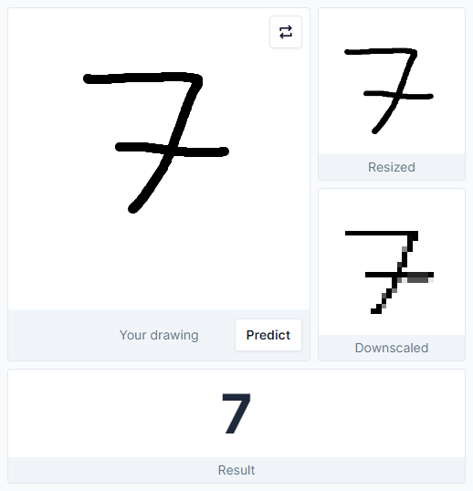

# Handwritten Digit Recognition

This is a web interface to a Convolutional Neural Network (CNN) for classifying handwritten digits. You can draw any digit from 0 to 9, see the preprocessing results, and view the prediction. The model is a small CNN trained on the [MNIST dataset](http://yann.lecun.com/exdb/mnist/). Try it out [here](https://mwpryer-digit-recognition.up.railway.app/).

    

## Overview

### Model

The CNN model is constructed using TensorFlow and Keras in Python and is trained on the [MNIST dataset](http://yann.lecun.com/exdb/mnist/), which comprises 60,000 28x28 grayscale images of handwritten digits.

The model operates on a Flask server, a Python web framework, and can be accessed through a `POST` request with the preprocessed pixel intensities of the digit for classification.

### Interface

The web interface is hosted on a Flask server and developed using JavaScript, HTML, and Tailwind CSS.

Preprocessing of the drawn digit occurs entirely within the browser. To align with the original dataset, several steps are necessary before the digit is ready for classification by the model:

- First, the digit is resized to a 200x200 pixel image, which is then centered within a 280x280 pixel frame.
- Next, the image is downscaled to 28x28 pixels to match the input size of the training data.
- Finally, pixel intensities are averaged over the RGB channels and normalized to a range between 0 and 1.

These transformations are accomplished by manipulating the underlying pixel data on the HTML canvas, relevant functions are located in `utils.js`.

The `script.js` file manages user input, preprocesses the drawn digit using the steps mentioned above, sends the pixel intensities to the server for classification, and displays the prediction.
